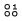
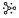

---

copyright:
  years: 2020
lastupdated: "2020-10-23"

keywords: getting started tutorial, Master Data Management, MDM, Cloud Pak for Data as a Service, IBM Cloud

subcollection: mdm-oc

---

{:shortdesc: .shortdesc}
{:new_window: target="_blank"}
{:codeblock: .codeblock}
{:pre: .pre}
{:screen: .screen}
{:tip: .tip}
{:note: .note}
{:external: target="_blank" .external}

# Getting started tutorial
{: #getting-started}

{{site.data.keyword.mdm-oc_full}} (Beta) on IBM Cloud Pak for Data as a Service enables you to establish a single, trusted, 360-degree view of your customers — a digital twin. This getting started tutorial walks you through the steps of setting up and using {{site.data.keyword.mdm-oc_full}} to onboard, match, and explore your master data.
{: shortdesc}

The {{site.data.keyword.mdm-oc_full}} Beta lite plan allows you to create one service instance per account and process up to one million records. Beta lite plan services are active for 60 days or until the Beta period is over, whichever comes first. Beta lite plan services will be deleted after 30 days of inactivity.
{: note}

For more information, see [About Master Data Management](/docs/mdm-oc?topic=mdm-oc-about).

For detailed instructions and information about using the {{site.data.keyword.mdm-oc_full}} service, see [Managing master data](https://dataplatform.cloud.ibm.com/docs/content/wsj/mdm/getting-started.html) in the Cloud Pak for Data as a Service documentation application.

## Before you begin
{: #prereqs}

### Starting from Cloud Pak for Data as a Service

1. Go to [dataplatform.cloud.ibm.com](https://dataplatform.cloud.ibm.com). 
2. Log in with your personal {{site.data.keyword.Bluemix_notm}} credentials or create an account.
2. Create a {{site.data.keyword.mdm-oc_full}} service instance. For details, see [Creating services](https://dataplatform.cloud.ibm.com/docs/content/wsj/admin/create-services.html) in the Cloud Pak for Data as a Service documentation.

### Starting from {{site.data.keyword.Bluemix_notm}}

1. Go to [cloud.ibm.com](https://cloud.ibm.com).
2. Log in with your personal {{site.data.keyword.Bluemix_notm}} credentials or create an account.
3. From your dashboard, click **Create resource**, then choose **Services** from the left navigation pane.
4. Select the **Master Data Management** tile to create a {{site.data.keyword.mdm-oc_full}} service instance.

## Step 1. Creating a master data configuration asset

The first step in setting up {{site.data.keyword.mdm-oc_full}} is to create your master data configuration asset. The configuration asset is where you will onboard data sources, map your data into the system, customize your data model, and set up and tune the matching algorithm.

1. Go to [dataplatform.cloud.ibm.com](https://dataplatform.cloud.ibm.com).
2. Under My services, click **View all** to open the service instances associated with your account.
3. Click on your {{site.data.keyword.mdm-oc_full}} instance to open the Launch page. 
4. Click **Launch** to open the master data home page. 
5. Click **Set up master data** to create your configuration asset.
   
   You must have the correct adminstrator privileges to be able to create and configure a configuration asset.
   {:note}
   
6. Review the service instance name. Optionally, rename it to be more descriptive. Click **Next**.
7. Select an existing Cloud Pak for Data as a Service project to use with this {{site.data.keyword.mdm-oc_full}} service instance or create a new one by clicking **+**. Click **Next**.
8. Optionally, you can associate your {{site.data.keyword.mdm-oc_full}} instance with a catalog. Choose a catalog from your associated Watson Knowledge Catalog instance, or create a new one by clicking **+**. If there is no associated Watson Knowledge Catalog service, you can create one. 
9. Click **Finish**.
   
You've now created your master data configuration asset. Let's get it set up and match some data!

## Step 2. Loading your first data asset into {{site.data.keyword.mdm-oc_full}}

In this step, we'll add a flat data file in CSV or TSV format. If you have a data file containg customer records already, you can use that.

If you don't have a data file ready to go but want to get started using {{site.data.keyword.mdm-oc_full}}, you can skip this step and load the provided sample data and model instead. From the master data home page, go to the **Master data** tile, then click **Publish sample model**. After the model loads, click **Publish sample data**.
{: note}

1. From the master data home page, click **Configuration** to open the Data setup screen. Click **Start with data assets**. 
2. Click **Add data** or the **Find and add data** icon  in the action bar at the top of the screen.
3. From the Data panel that opens, choose whether to add data by upload, from the project, or from the catalog. For this tutorial, choose **Load** to upload a data file.
4. On your local machine, select a flat data file in CSV or TSV format and drag it into the Data panel. When the file finishes uploading, it is added to your assets summary list.
5. Review the details of your newly added asset. If your asset does not have any information in the **Asset record type** column, you must define the record type.
   - Select your asset in the assets summary list.
   - Click **Assign record type** and select the correct record type from the list. If the appropriate record type is not in the list, then you might have to customize your data model.

## Step 3. Customizing your data model (optional)

When you onboard your first data asset, {{site.data.keyword.mdm-oc_full}} automatically generates the data model using a combination of industry standard model attributes and embedded Watson technology. When you upload additional data, the model will intelligently adjust itself to accomodate newly populated attributes and fields. You can always customize the model to match your organization's requirements by adding new record types, attributes, and fields.

1. On the Data setup screen, click the **Modeling** tab.
2. Review the current model's record types and attribute types. 
3. From here, you can:
   - View or edit existing record types or create new ones. By default, the data model includes definitions for Person and Organization record types.
   - View or edit existing attribute types or create new ones. You can add or remove fields in each attribute type to reflect your organization's data model requirements.
4. When you are done, click the publish model icon   in the action bar at the top of the screen.
   
## Step 4. Mapping your data into the data model

Each data source or asset must be mapped and loaded into the data model before it can be used in MDM functions such as matching. {{site.data.keyword.mdm-oc_full}} includes a powerful automapping capability that removes the need for data engineers to manually map each column of data into the model. The automapping feature detects, analyzes, and categorizes each column of data to the corresponding attributes or fields in the data model. Before you can run automapping, you must profile your data.

1. On the Data setup screen, click the **Mapping** tab.
2. From the Asset list in the left panel, select the data source that you want to map into the system. The data from the file displays in tabular format with a number of rows and columns. 
Each column represents an attribute that must be mapped to a corresponding attribute type in the data model. When you first open a data source or asset, each column is marked with a **Not Mapped** tag. 

   You can manually map each column if you choose, but you can greatly speed up the mapping process by taking advantage of the automapping feature.
   {: tip}

3. To enable automapping for this asset, you must first profile the data. Click **Profile**. 
Profiling analyzes and classifies your data to enable the automapping process to take place. Profiling can take some time to complete, so it runs in the background to allow you to continue working. You might want to start reviewing and manually mapping some columns. 

   Automapping will never overwrite any manual mapping that you have done.
   {: note}
   
4. When profiling completes, click **Auto map**. {{site.data.keyword.mdm-oc_full}} analyzes your data and automatically maps as many columns as possible into the data model. Even if it cannot map a given column, the automap function can suggest some of the most likely mapping selections.
5. Review the automapping. If any of the mappings are incorrect, or if a column remains unmapped, then manually map it correctly. Alternately, if a given column is not required, you can exclude it from your MDM data load.
7. To manually map a column, select it, then use the **Mapping targets** panel on the right to search for and select the appropriate attribute or field from the data model. Click **Map and save to data model**.
   
   Scroll right and left through the columns to ensure that every column in your data source is mapped.
   {: tip}

8. When you've finished mapping the data source, you're ready to publish the data into the system. 
    - If your data model is new or has changed, you'll need to publish your model first by clicking the publish model icon  in the action bar. Wait for the publish job to complete.
    - To publish your data, click the publish data icon  in the action bar. Wait for the publish job to complete.
9. Return to the data setup Overview page by clicking the **Data setup** page title and selecting **Overview** from the list.
10. On the Overview page, confirm that you have at least one data source or asset added and mapped.
 
## Step 5. Setting up and running matching

When your data is mapped and published into the {{site.data.keyword.mdm-oc_full}} service, you can run the powerful matching process on the data. The matching process analyzes your data to determine if there are any duplicate records in your data. Suspected duplicate records are merged into master data entities to establish a single, trusted, 360-degree view of your customers. Each entity contains one or more records.

Before running matching, ensure that you have published your data model and sources to the {{site.data.keyword.mdm-oc_full}} system.
{: tip}

1. On the Data setup Overview screen, click the **Overview** page title and select **Matching setup**.
2. Go to the **Match settings** tab to select the attributes to use in matching data. The first time you navigate to this tab, {{site.data.keyword.mdm-oc_full}} will automatically generate some suggested attributes from your data model to use in matching.
3. Review the list of matching attributes. These attributes will be used as the basis of comparison to match records and create master data entities. To add or remove attributes from the list, click **Select attributes** then select or deselect attributes as needed.
4. When you are satisfied with your matching attributes, click the run matching icon  in the action bar. The matching process will take a while to complete. It will run in the background so that you can continue working. You'll be notified when it's complete.
5. When matching is complete, go to the **Match results** tab to see a dashboard of statistics and visualizations to provide insight about your master data. 
   
   You can adjust your matching algorithm at any time by editing your matching attributes.
   {: tip}

As you add more data sources and assets to your {{site.data.keyword.mdm-oc_full}} system and rerun matching, the new data will be matched both within itself and against the existing data in the system. In this way, you can build a unified, single, 360-degree view of your customers across your entire enterprise.

## Step 6. Exploring your master data

After a data engineer has configured the {{site.data.keyword.mdm-oc_full}} service, loaded and mapped data, and run matching, a business analyst or data steward user can explore the master data to search, view, and analyze it. 

1. From the master data home page, click **Search master data** to open the master data explorer.
2. Search within your data to find data to explore. You can choose whether to search for entities or records, and you can either run a simple text search or an advanced search using rules.
3. From your search results list, you can:
   - Click a row to see details of the entity or record. 
   - Use the row's three-dot menu or Explore icon  to select an entity or record for further exploration in the Explore tab.
   When you send an entity or record to the Explore tab, you can more closely review its details and compare it to any other entities or records in the Explore tab.
4. Choose the **Explore** tab to review and compare the details of any entities or records that you selected for exploration.
5. Select any of the entities or records in the **Entity explorer** panel to view their detailed attributes.

From the master data explorer, you can also: 
   - Export data.
   - Add individual records.
   - Edit individual records.

## Learn more

For detailed instructions and information about setting up and using the {{site.data.keyword.mdm-oc_full}} service, see [Managing master data](https://dataplatform.cloud.ibm.com/docs/content/wsj/mdm/getting-started.html) in the Cloud Pak for Data as a Service documentation application.

For information about the {{site.data.keyword.mdm-oc_full}} API, see the {{site.data.keyword.mdm-oc_full}} [API reference documentation](https://cloud.ibm.com/apidocs/mdm).

For information about Cloud Pak for Data as a Service, see the [Cloud Pak for Data as a Service documentation](https://dataplatform.cloud.ibm.com/docs/content/wsj/getting-started/welcome-main.html).
